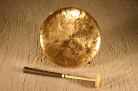
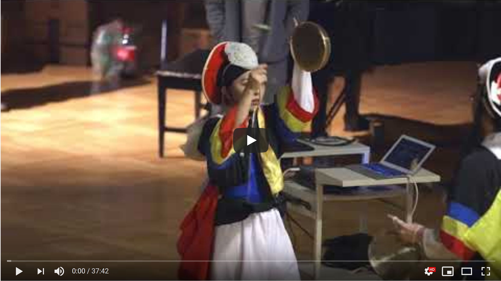

# Project 4 - Design & Plan

Be clear and concise in your writing. Bullets points are acceptable.


# Planning

## Client Description (Milestone 1)
> Tell us about your client. Who is your client? What kind of website do they want? What are their key goals?

Shimtah is the one and only Korean Traditional Percussion group of Cornell University and in the Ithaca area, working as the cultural ambassador to preserve and spread the spirit of Korean culture. Shimtah would like a informative website used to introduce the club, inform people about Korean traditional music, and recruit new members.


> NOTE: **If you are redesigning an existing website, give us the current URL and some screenshots of the current site.** Tell us how you plan to update the site in a significant way that meets the Project 4 requirements.


## Site's Purpose (Milestone 1)
> Tell us the purpose of the website and what it is all about.

The site has a few purposes. To start, it will explain Korean percussion and its history to users who do not know what it is. The site will also be a portal for interacting with the club, including links to social media, contact forms, and upcoming performance schedules. It will also host content that the club creates, such as videos and photos from performances.

<!-- - Have a contact form used for recruiting future members
- Inform people about Korean traditional music and instruments
- Inform people about the club's history and current members
- Have a photo & video gallery of past performances
- Inform people about upcoming performances -->

## Client Meeting Notes (Milestone 1)
> Include your notes/minutes from the client meeting, an email they sent you, or whatever you used to keep track of what was discussed at the meeting.

  - STILL NEED THESE

## Client Needs and Wants (Milestone 1)
> Collect your client's needs and wants for the website. Come up with several appropriate design ideas on how those needs may be met. In the **Memo** field, justify your ideas and add any additional comments you have. There is no specific number of needs required for this, but you need enough to do the job.

Needs/Wants: [Brief Title]
- **Needs and Wants** [What does your client need and want?]
  - TODO
- **Design Ideas and Choices** [How will you meet those needs and wants?]
  - TODO
- **Memo** [Justify your decisions; additional notes.]
  - TODO

- **Need/Want**
  - A place to show photos and videos
- **Design Ideas and Choices**
  - 2 pages, one for photos and one for videos
  - Display 8-12 photos on the page in a grid format
  - For videos, take thumbnails from youtube videos, display them as links to the videos themselves
- **Memo**
  - Because there aren't that many photos, we have more space on the screen to display them, so they can be bigger/higher quality. They also don't need to be organized in any way (chronological, etc.), so we can put them in a grid format
  - Having links to youtube videos via thumbnails circumvents needing to embed the videos, while still providing users a photographic preview of the video they'll be seeing, which would be lost in a text link.

- **Need/Want**
  - A description of Shimtah, Korean percussion, and its history
- **Design Ideas and Choices**
  - An "instruments" page that shows off all of the instruments used in Korean percussion, with pictures.
  - An "about" page that describes the history of the club, as well as brief introductions from club members
- **Memo**
  - Because all of the instruments in Korean percussion are unique, it makes sense to have a whole page dedicated to explaining them.
  - The information about the instruments should be separate from the information about the club, so users can find relevant information more quickly, hence the separate about page.

- **Need/Want**
  - A way to learn about and contact the club
- **Design Ideas and Choices**
  - The aforementioned "about" page that will have the history of the club, as well as member bios.
  - A contact form at the bottom of this page, where users will be prompted for name, email, and year.
  - Logos at the footer of each page for instagram, youtube, and facebook, that link to Shimtah's respective page on each of those platforms. The club's email will also be in the footer.
- **Memo**
  - Having bios of current members makes the club more personable, which prospective members would want
  - A contact form is the best way to reach out to prospective members. We will put it on the same page as the rest of the information about the club because it is club-logistics-related, as opposed to Korean-percussion-related.
  - Having logos at the footer will make Shimtah's additional pages accessible from anywhere on the site.

> Tell us about the users (target audience) for this website.

Mainly Korean & Korean American students at Cornell University or any student who is interested in Korean culture or percussion music group

## Discovering Users' Needs (Milestone 1)
> You'll need to discover your users' needs. Talk to them! Document what you've learned about them. When talking to your users, take notes and include those notes here.


## Users' Needs (Milestone 1)
> Analyze the users' needs and wants from your notes above. List each need/want below. There is no specific number of needs required for this, but you need enough to do the job.
> **Note:** These are probably *not* the needs of your client.

Need/Want: [Brief Title]
- **Needs and Wants** [What do the users need and want?]
  - TODO
- **Design Ideas and Choices** [How will you meet those needs and wants?]
  - TODO
- **Rationale & Additional Notes** [Justify your decisions; additional notes.]
  - TODO

Need/Want: ...


## User Testing Plan (Milestone 1)
> Plan out your tasks for evaluating whether your site will meet the needs of the users. These must be actual user testing tasks. Tasks are not questions!

1. Get on the club's mailing list

2. Find out which Shimtah instruments would be interesting to you

3. Find a video of current club members playing that instrument

4. See if you know anyone already in the club


## Content (Milestone 1)
> Plan out your site's content (text, images, etc.). Make a list of **all** the content you will need. This list should be **exhaustive**.

We will have five pages for the website: Index, About, Instruments, Photo, Video

- Index Page: Welcome message, Club logo, information about upcoming performance
  - Upcoming performance: Shimtah's 20th Anniversary and the 19th Annual Concert.
  - Date: 2020 / 2 / 8 (Saturday, TBD), Willard Straight Hall, 5PM ~ 7PM (TBD), Free tickets, Dinner provided

- About Page: Introduction to the Club & Contact form
  - Club Photo with a club description.
  
  - "Welcome to Shimtah! Shimtah was established in 1999 as the one and only Korean Traditional Percussion group at Cornell University and the Ithaca area, working as the cultural ambassador to preserve and spread the spirit of Korean culture. Practices are held on Saturdays 5–7 PM in Lincoln Hall B20 on the Cornell University. For more information or to request a performance for 2019–2020, contact Mira Kim (mk864@cornell.edu)."

  - E-Board Member Introduction: Pictures, Year, Major, Position, Instrument

    - President:
      
      - Mira Kim / C' 2019 / ECE / President & Buswe / Swe, Janggu, Jing

    - Vice President:
      
      - Eunah Song / C' 2021 / Biology / Vice President & Sangjanggu / Swe, janggu

    - Musical Director:
      
      - JeongHyun Lee / C' 2021 / Info Sci & Econ / Swe, Janggu

    - Secreatary:
      
      - SeungJin Park / C'2022 / Info Sci / Swe, Buk, Jing

    - Treasurer:
      
      - ShinHyuk Seo / C'2019 / BME / Buk, Jing


  - Contact form: directed to president's email (mk864@cornell.edu). Name / Email / Year / How did you find out about us?

- Instruments Page: Introduction to the history of Korean percussion music and instruments we play
  - Pungmul (Korean: 풍물; ) is a Korean folk music tradition that includes drumming, dancing, and singing. Most performances are outside, with dozens of players all in constant motion. Pungmul is rooted in the dure (collective labor) farming culture. It was originally played as part of farm work, on rural holidays, at other village community-building events, and to accompany shamanistic rituals, mask dance dramas, and other types of performance.
  - A group of four men led by Kim Duk-soo and Kim Yong-bae, both descendants of namsadang troupe members, performed an impromptu arrangement of Pyeongtaek (utdari) pungmul with each of its four core instruments. Unlike traditional pungmul, this performance was conducted in a seated position facing the audience and demonstrated a variety of rhythms with great flexibility.
  - Shimtah bases its roots in Imsil Pilbong Pungmul, performing Pangut, Seonban Seoljanggu, Bukchum, Yeongnam Samul, and Cornell Samul.
  - These are four core instruments played in Pungmul.

https://omeka1.grinnell.edu/MusicalInstruments/items/show/352
- 
- The Kkwaneggwari, often noted as "swe", is a small flat gong producing distinctively high-pitched, metallic tone that breaks into a cymbal-like crashing timbre when struck forcefully. Swe is typically the lead instrument in pungmul, and the lead swe of the group serves as the musical lead of the group.

http://www.soundofasia.com/jikotrgo.html
- 
- The Jing is a large gong made of brass and is struck by a stick that is layered with cloth at one end to soften the texture of the sound produced. It is capable of producing a gentle and lingering sound as well as a big sound with a roaring effect, depending on force applied when striking against the brass.

http://www.soundofasia.com/bukkobadr151.html
- 
- The Buk is a traditional Korean drum. While the term buk is a native Korean word used as a generic term meaning "drum", it is most often used to refer to a shallow barrel-shaped drum, with a round wooden body that is covered on both ends with animal skin
https://www.lapercussionrentals.com/instruments/janggu/591
- 
- The Janggu is the most representative drum in Korean percussion music. It is available in most kinds, and consists of an hourglass-shaped body with two heads made from animal skin. The two heads produce sounds of different pitch and timbre, which when played together are believed to represent the harmony of man and woman.

- Photo gallery
  - Photos from past performances / past years to note Shimtah's history
- Video gallery
  - Videos from past performances, linked to Shimtah's Youtube Channel

Youtube video thumbnails:

- 
- 
- 
- 
- 
- 
- 


## Interactivity Ideas (Milestone 1)
> Come up with some idea for interactive features for your site.

- One of the main reasons the client has asked for a website is to recruit future members. We would have a interactive form for anyone who is interested in the club can submit their contact information. The E-board members of Shimtah would be able to contact that person and let them know more about the club or when we would be recruiting for new members.

# Design & Evaluation

## Design Process (Milestone 1)
> Document your design process. Show us your card sorting. Design your navigation from the card sorting. Outline your navigation. Describe your theme. Show us sketches of your site (mobile and desktop versions). etc.
> You should show us how your came up with your design and how your iterated on that design; show us the evolution of your design.

> **Note:** Card sorting is used to organize your site's content. For each piece of content identified in the previous section, write a summary of that content onto a card. Now sort the cards. The grouping of cards provides you with your pages for your website. **Do not write down the pages you want and then "card sort" those. That is not card sorting.**


## Interactivity (Milestone 1)
> What interactive features will your site have? Describe how the interactivity connects with the needs of the clients/target audience.


## User Testing (_optional_)
> This testing is optional.

### User 1 - Testing Notes (Milestone 1)
> When conducting user testing, you should take notes during the test. Place your notes here.


### User 1 (Milestone 1)
> Using your notes from above, describe your user by answering the questions below.

1. Who is your user, e.g., where does the user come from, what is the user's job, characteristics, etc.?


2. Does the user belong to your target audience of the site? (Yes / No)
> If “No”, what’s your strategy of associating the user test results to your target audience’s needs and wants? How can your re-design choices based on the user tests make a better fit for the target audience?


### User 1 - **Desktop** (Milestone 1)
> Report the results of your user's evaluation. You should explain **what the user did**, describe the user's **reaction/feedback** to the design, **reflect on the user's performance**, determine what **re-design choices** you will make. You can also add any additional comments. See the example design journey for an example of what this would look like.

Task: [TODO: copy task here]
- **Did you evaluate the desktop or mobile design?**
  - Pick one: desktop/mobile
- **How did the user do? Did they meet your expectation?**
  - TODO
- **User’s reaction / feedback to the design** (e.g., specific problems or issues found in the tasks)
  - TODO
- **Your reflections about the user’s performance to the task**
  - TODO
- **Re-design choices**
  - TODO
- **Additional Notes**
  - TODO: Justify your decisions; additional notes.

...


### User 2 - Testing Notes (Milestone 1)
> When conducting user testing, you should take notes during the test. Place your notes here.


### User 2 (Milestone 1)
> Using your notes from above, describe your user by answering the questions below.

1. Who is your user, e.g., where does the user come from, what is the user's job, characteristics, etc.?


2. Does the user belong to your target audience of the site? (Yes / No)
> If “No”, what’s your strategy of associating the user test results to your target audience’s needs and wants? How can your re-design choices based on the user tests make a better fit for the target audience?


### User 2 - **Mobile** (Milestone 1)
> Report the results of your user's evaluation. You should explain **what the user did**, describe the user's **reaction/feedback** to the design, **reflect on the user's performance**, determine what **re-design choices** you will make. You can also add any additional comments. See the example design journey for an example of what this would look like.

Task: [TODO: copy task here]
- **Did you evaluate the desktop or mobile design?**
  - Pick one: desktop/mobile
- **How did the user do? Did they meet your expectation?**
  - TODO
- **User’s reaction / feedback to the design** (e.g., specific problems or issues found in the tasks)
  - TODO
- **Your reflections about the user’s performance to the task**
  - TODO
- **Re-design choices**
  - TODO
- **Additional Notes**
  - TODO: Justify your decisions; additional notes.

...


## Final Design (Milestone 1)
> Include the final sketches for each of your pages. These sketches **must** hand-drawn.

**Desktop Design:**


**Mobile Design:**


## Additional Comments (Milestone 1)
> If you feel like you haven't fully explained your design choices, or if you want to explain some other functions in your site (such as special design decisions that might not meet the Project 4 requirements), you can use this space to justify your design choices or ask other questions about the project and process.


---

# Iteration 2

## Client Feedback (Milestone 2)
> You have met once with your client a second time to discuss your initial design. Include your notes from the meeting, an email they sent you, or whatever you used to keep track of what was discussed at the meeting. Write a few sentences about the design feedback you received from your client.


## Interactivity Plan (Milestone 2)
> Write your interactivity pseudocode here.

Example:
```
when DOM is loaded:

  if today is a monday:
    show Monday's soup and Monday's daily special

```

## Additional Comments (Milestone 2)
> If you feel like you haven't fully explained your design choices, or if you want to explain some other functions in your site (such as special design decisions that might not meet the Project 4 requirements), you can use this space to justify your design choices or ask other questions about the project and process.


---

# Iteration 3

## Additional Comments (Milestone 3)
> If you feel like you haven't fully explained your design choices, or if you want to explain some other functions in your site (such as special design decisions that might not meet the Project 4 requirements), you can use this space to justify your design choices or ask other questions about the project and process.


---

# Final Evaluation

## Changes Based on Lab 13 Peer Feedback (Final Submission)
> What changes did you make to your design based on your peers' feedback?


## User Testing
> If you conducted user testing in Milestone 1, you only need to user test 2 more users. Otherwise, you must conduct user testing with 4 users.

### User 3 - Testing Notes (Final Submission)
> When conducting user testing, you should take notes during the test. Place your notes here.


### User 3 (Final Submission)
> Using your notes from above, describe your user by answering the questions below.

1. Who is your user, e.g., where does the user come from, what is the user's job, characteristics, etc.?


2. Does the user belong to your target audience of the site? (Yes / No)
> If “No”, what’s your strategy of associating the user test results to your target audience’s needs and wants? How can your re-design choices based on the user tests make a better fit for the target audience?


### User 3 - **Desktop** (Final Submission)
> Report the results of your user's evaluation. You should explain **what the user did**, describe the user's **reaction/feedback** to the design, **reflect on the user's performance**, determine what **re-design choices** you will make. You can also add any additional comments. See the example design journey for an example of what this would look like.

Task: [TODO: copy task here]
- **Did you evaluate the desktop or mobile design?**
  - Pick one: desktop/mobile
- **How did the user do? Did they meet your expectation?**
  - TODO
- **User’s reaction / feedback to the design** (e.g., specific problems or issues found in the tasks)
  - TODO
- **Your reflections about the user’s performance to the task**
  - TODO
- **Re-design choices**
  - TODO
- **Additional Notes**
  - TODO: Justify your decisions; additional notes.

...


### User 4 - Testing Notes (Final Submission)
> When conducting user testing, you should take notes during the test. Place your notes here.


### User 4 (Final Submission)
> Using your notes from above, describe your user by answering the questions below.

1. Who is your user, e.g., where does the user come from, what is the user's job, characteristics, etc.?


2. Does the user belong to your target audience of the site? (Yes / No)
> If “No”, what’s your strategy of associating the user test results to your target audience’s needs and wants? How can your re-design choices based on the user tests make a better fit for the target audience?


### User 4 - **Mobile** (Final Submission)
> Report the results of your user's evaluation. You should explain **what the user did**, describe the user's **reaction/feedback** to the design, **reflect on the user's performance**, determine what **re-design choices** you will make. You can also add any additional comments. See the example design journey for an example of what this would look like.

Task: [TODO: copy task here]
- **Did you evaluate the desktop or mobile design?**
  - Pick one: desktop/mobile
- **How did the user do? Did they meet your expectation?**
  - TODO
- **User’s reaction / feedback to the design** (e.g., specific problems or issues found in the tasks)
  - TODO
- **Your reflections about the user’s performance to the task**
  - TODO
- **Re-design choices**
  - TODO
- **Additional Notes**
  - TODO: Justify your decisions; additional notes.

...


### User 5 - Testing Notes (Final Submission)
> When conducting user testing, you should take notes during the test. Place your notes here.


### User 5 (Final Submission)
> Using your notes from above, describe your user by answering the questions below.

1. Who is your user, e.g., where does the user come from, what is the user's job, characteristics, etc.?


2. Does the user belong to your target audience of the site? (Yes / No)
> If “No”, what’s your strategy of associating the user test results to your target audience’s needs and wants? How can your re-design choices based on the user tests make a better fit for the target audience?


### User 5 - **Desktop** (Final Submission)
> Report the results of your user's evaluation. You should explain **what the user did**, describe the user's **reaction/feedback** to the design, **reflect on the user's performance**, determine what **re-design choices** you will make. You can also add any additional comments. See the example design journey for an example of what this would look like.

Task: [TODO: copy task here]
- **Did you evaluate the desktop or mobile design?**
  - Pick one: desktop/mobile
- **How did the user do? Did they meet your expectation?**
  - TODO
- **User’s reaction / feedback to the design** (e.g., specific problems or issues found in the tasks)
  - TODO
- **Your reflections about the user’s performance to the task**
  - TODO
- **Re-design choices**
  - TODO
- **Additional Notes**
  - TODO: Justify your decisions; additional notes.

...


### User 6 - Testing Notes (Final Submission)
> When conducting user testing, you should take notes during the test. Place your notes here.


### User 6 (Final Submission)
> Using your notes from above, describe your user by answering the questions below.

1. Who is your user, e.g., where does the user come from, what is the user's job, characteristics, etc.?


2. Does the user belong to your target audience of the site? (Yes / No)
> If “No”, what’s your strategy of associating the user test results to your target audience’s needs and wants? How can your re-design choices based on the user tests make a better fit for the target audience?


### User 6 - **Mobile** (Final Submission)
> Report the results of your user's evaluation. You should explain **what the user did**, describe the user's **reaction/feedback** to the design, **reflect on the user's performance**, determine what **re-design choices** you will make. You can also add any additional comments. See the example design journey for an example of what this would look like.

Task: [TODO: copy task here]
- **Did you evaluate the desktop or mobile design?**
  - Pick one: desktop/mobile
- **How did the user do? Did they meet your expectation?**
  - TODO
- **User’s reaction / feedback to the design** (e.g., specific problems or issues found in the tasks)
  - TODO
- **Your reflections about the user’s performance to the task**
  - TODO
- **Re-design choices**
  - TODO
- **Additional Notes**
  - TODO: Justify your decisions; additional notes.

...


## Changes Based on User Testing (Final Submission)
> What changes did you make to your design based on user testing?


## Final Notes to the Graders (Final Submission)
> 1. Give us three specific strengths of your site that sets it apart from the previous website of the client (if applicable) and/or from other websites. Think of this as your chance to argue for the things you did really well.


> 2. Tell us about things that don't work, what you wanted to implement, or what you would do if you keep working with the client in the future. Give justifications.


> 3. Tell us what you, as a team, learned while working on this project.


> 4. Tell us anything else you need us to know for when we're looking at the project.
